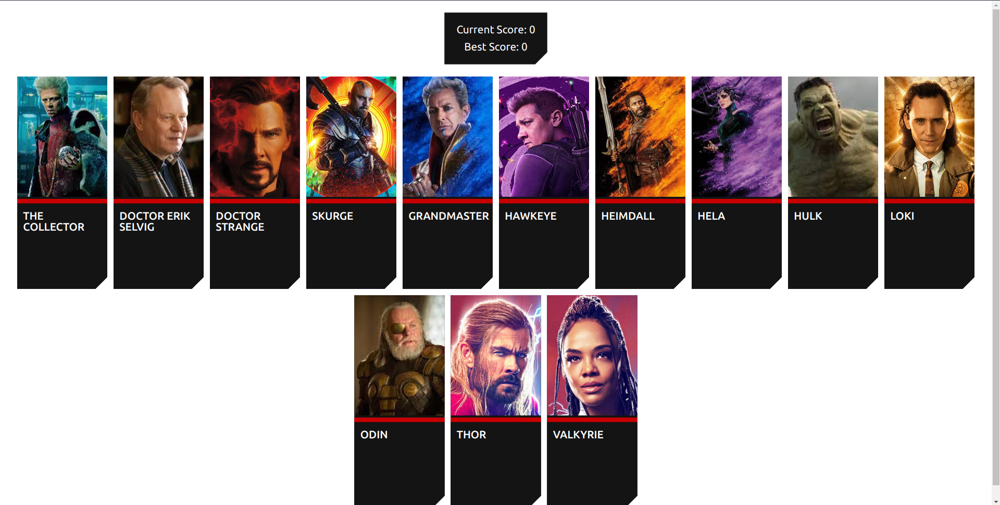

# Memory Cards

## Description

This is a memory card game. The goal is pretty simple: click cards, and remember which ones you've clicked! Click every card exactly once! Click all the cards, and you win! Click a single card twice, and it's game over.

I built this to practice using react. Specifically functional components and hooks, but also state and props.

This project came together pretty easily, although I shuffled around a little bit of the logic to find where it fits more naturally. I've been getting better at thinking in React. It also helped a lot to whiteboard out my ideas for the components and how they intereact with each other before starting.

## Credits

Special thanks to [The Odin Project](https://www.theodinproject.com/) for their lessons on learning React.

Also, I do not own any of the characters or pictures seen in this app; they belong to Marvel.

  
  

